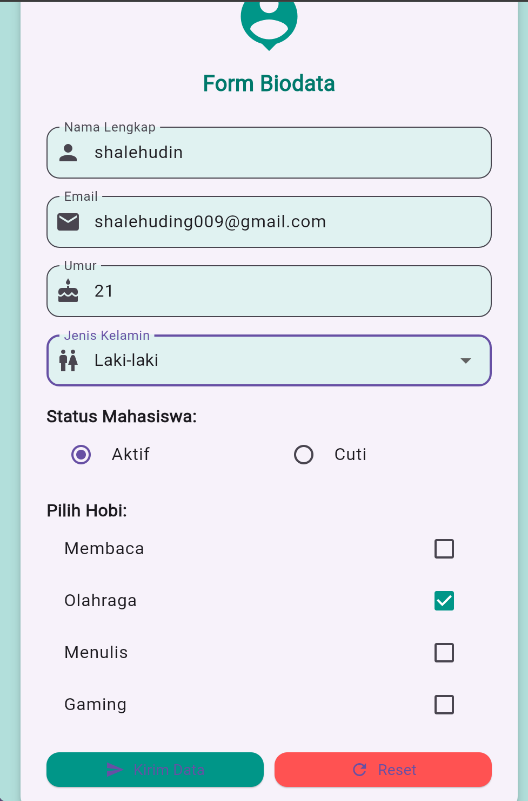

# Form Biodata App 📱

Aplikasi Flutter untuk mengisi dan menampilkan biodata pengguna dengan antarmuka yang user-friendly.

## 📋 Deskripsi

Form Biodata App adalah aplikasi mobile yang dibuat menggunakan Flutter untuk memudahkan pengguna dalam mengisi dan menyimpan data biodata pribadi. Aplikasi ini cocok digunakan untuk keperluan registrasi, pendataan, atau form pengisian data lainnya.

## ✨ Fitur

- 📝 Form input biodata lengkap
- 👤 Input nama, email, nomor telepon
- 📅 Pemilihan tanggal lahir
- 🎯 Validasi input data
- 📱 Responsive design
- 🎨 UI yang modern dan clean

## 🚀 Teknologi

- **Flutter SDK**: 3.x.x
- **Dart**: 3.x.x
- **Platform**: Android & iOS

## 📦 Instalasi

### Prasyarat
- Flutter SDK terinstall
- Android Studio / VS Code
- Emulator atau device fisik

### Langkah Instalasi

1. **Clone repository**
```bash
git clone https://github.com/shalehudin/form_biodata_app.git
cd form_biodata_app
```

2. **Install dependencies**
```bash
flutter pub get
```

3. **Run aplikasi**
```bash
flutter run
```

## 📸 Screenshot

### Form Input


### Result Display


## 🎯 Cara Penggunaan

1. Buka aplikasi
2. Isi form biodata dengan lengkap:
   - Nama lengkap
   - Email
   - Nomor telepon
   - Tanggal lahir
   - Alamat
3. Tekan tombol "Submit"
4. Lihat hasil biodata yang telah diisi

## 🛠️ Build APK

Untuk membuat file APK:

```bash
# Build APK Release
flutter build apk --release

# Build APK Split (lebih kecil)
flutter build apk --split-per-abi
```

File APK akan tersimpan di:
```
build/app/outputs/flutter-apk/app-release.apk
```

## 📱 Download APK

Download versi terbaru aplikasi:
- [Download APK v1.0.0](https://github.com/shalehudin/form_biodata_app/releases/download/v1.0.0/app-release.apk)

*Atau cek halaman [Releases](https://github.com/shalehudin/form_biodata_app/releases) untuk versi lainnya.*

## 🤝 Kontribusi

Kontribusi selalu welcome! Silakan:

1. Fork repository ini
2. Buat branch baru (`git checkout -b feature/AmazingFeature`)
3. Commit perubahan (`git commit -m 'Add some AmazingFeature'`)
4. Push ke branch (`git push origin feature/AmazingFeature`)
5. Buat Pull Request

## 📝 License

Distributed under the MIT License. See `LICENSE` for more information.

## 👨‍💻 Author

**Shalehudin**
- GitHub: [@shalehudin](https://github.com/shalehudin)
- Email: shalehudin8@gmail.com

## 🙏 Acknowledgments

- [Flutter Documentation](https://docs.flutter.dev/)
- [Material Design](https://material.io/design)
- Community Flutter Indonesia

---

⭐ Jangan lupa berikan star jika project ini bermanfaat!

**Made with ❤️ using Flutter**
